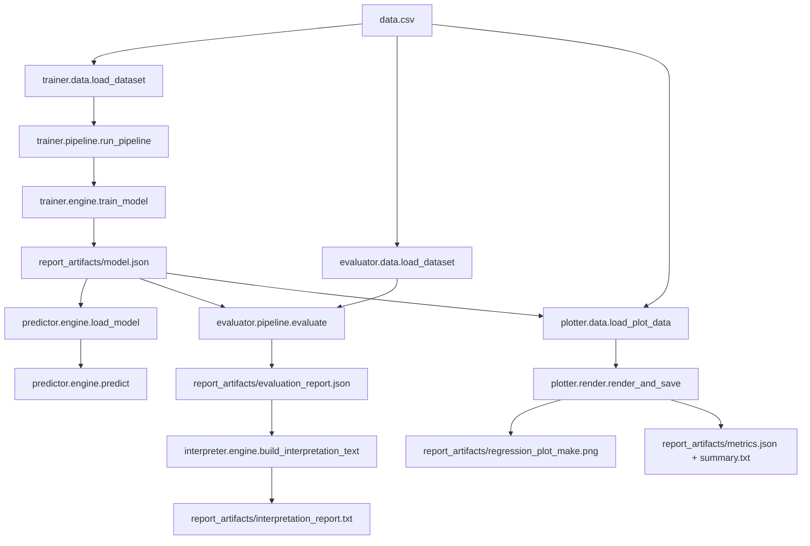
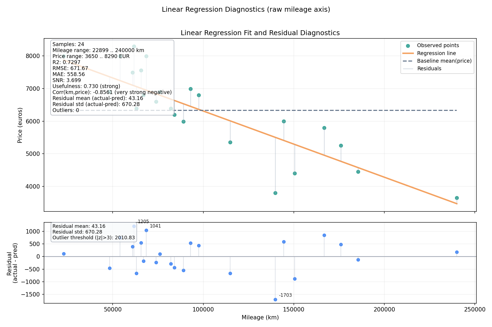
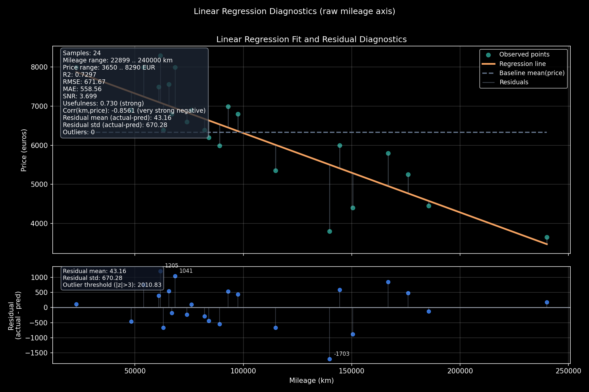

# ft_linear_regression


A production-style, educational linear regression project implemented in pure Python (no NumPy/pandas/scikit-learn).

## Project philosophy

This project is intentionally built for **clarity, correctness, and reproducibility**.

- Every ML step is explicit (data loading, normalization, gradient descent, evaluation).
- The system favors robust validation and predictable failure modes over hidden magic.
- The code is modularized so it can be reused as a small ML toolkit by developers.

## What this project does

The model predicts car price from mileage using a single linear relation:

\[
\hat{y} = \theta_0 + \theta_1 x
\]

Where:

- `x` is mileage in kilometers
- `\hat{y}` is predicted price
- `\theta_0` is intercept
- `\theta_1` is slope

Training uses gradient descent, then stores raw-scale parameters in `model.json` for direct prediction.

## Architecture diagram



For a detailed architecture view, see [docs/ARCHITECTURE.md](docs/ARCHITECTURE.md).

## Project tree (formatted)

```text
ft_linear_regression/
├── train.py                # training entrypoint
├── predict.py              # prediction entrypoint
├── evaluate.py             # evaluation entrypoint
├── plot.py                 # plotting entrypoint
├── interpret.py            # interpretation entrypoint
├── data.csv
├── Makefile
├── trainer/
├── predictor/
├── evaluator/
├── plotter/
│   ├── cli.py
│   ├── data.py
│   ├── diagnostics.py
│   ├── export.py
│   ├── model.py
│   ├── render.py
│   ├── report.py
│   └── theme.py
├── interpreter/
├── tests/
├── docs/
│   ├── ARCHITECTURE.md
│   ├── API.md
│   └── assets/
│       ├── regression_plot_light.png
│       └── regression_plot_dark.png
└── report_artifacts/
    ├── model.json
    ├── evaluation_report.json
    ├── interpretation_report.txt
    ├── metrics.json
    ├── summary.txt
    └── regression_plot_make.png
```

## Design decisions

1. **Pure Python first**
   - Chosen for pedagogy and transparency.
   - Tradeoff: slower on very large datasets.

2. **Strong input validation**
   - CSV fields are validated for presence, numeric parsing, and finite values.
   - Model payloads are schema-checked and version-checked.

3. **Typed, modular architecture**
   - Dataclasses and explicit module boundaries (`trainer`, `predictor`, `evaluator`, `plotter`, `interpreter`).

4. **Baseline-driven evaluation**
   - Model quality is always compared to a naive baseline (`predict mean(price)`).

5. **Dual policy behavior in prediction**
   - Strict/non-strict model loading and fail-fast/skip-invalid input control.

## Numerical stability

The implementation includes multiple guards for numerical robustness:

- Mileage normalization during training: improves gradient descent conditioning.
- `EPSILON` thresholds for near-zero variance checks.
- Finite checks with `math.isfinite` for inputs and model parameters.
- Overflow/sanity guard on predictions (`MAX_ABS_PREDICTION`).
- Early stopping (`patience`, `min_delta`) to stop stalled or unstable runs.
- R2 handled as undefined when target variance is effectively zero.

## Requirements philosophy

The project intentionally minimizes dependencies:

- Core ML logic: Python standard library only.
- Plotting: `matplotlib` only (optional for non-plot workflows).
- No hidden dependency chain for training/prediction/evaluation logic.

This keeps the project easy to audit, portable, and educational.

## Python environment (`.venv/bin/python`)

### Option A: activate virtualenv

```bash
python3 -m venv .venv
source .venv/bin/activate
python -m pip install --upgrade pip
pip install matplotlib
```

### Option B: call the interpreter directly (recommended for scripts/CI)

```bash
python3 -m venv .venv
.venv/bin/python -m pip install --upgrade pip
.venv/bin/pip install matplotlib

.venv/bin/python train.py
.venv/bin/python predict.py --mileage 90000
```

## Execution guide

### With Makefile (recommended)

```bash
make help
make deps
make makeup
```

Common targets:

```bash
make train
make predict MILEAGE=85000
make evaluate
make interpret
make plot
make test
```

### Without Makefile

```bash
.venv/bin/python train.py --dataset data.csv --model report_artifacts/model.json
.venv/bin/python evaluate.py --dataset data.csv --model report_artifacts/model.json --report report_artifacts/evaluation_report.json
.venv/bin/python interpret.py --report report_artifacts/evaluation_report.json --output report_artifacts/interpretation_report.txt
.venv/bin/python plot.py --dataset data.csv --model report_artifacts/model.json --output report_artifacts/regression_plot_make --report-dir report_artifacts --generate-report-images
.venv/bin/python predict.py --model report_artifacts/model.json --mileage 100000 --json
```

Generate optional gradient descent animation:

```bash
.venv/bin/python plot.py \
  --dataset data.csv \
  --model report_artifacts/model.json \
  --output report_artifacts/regression_plot_make \
  --report-dir report_artifacts \
  --animate-training \
  --animation-iterations 120 \
  --animation-fps 8
```

## Real `model.json` example

Extract from [report_artifacts/model.json](report_artifacts/model.json):

```json
{
  "version": 1,
  "theta0": 8338.408469123708,
  "theta1": -0.020281070924980705,
  "model": {
    "theta0": 8338.408469123708,
    "theta1": -0.020281070924980705,
    "normalized_theta0": 6196.699999999996,
    "normalized_theta1": -1105.60796169484,
    "km_mean": 105601.35,
    "km_std": 54514.27914159281
  },
  "training": {
    "iterations": 10000,
    "iterations_ran": 450,
    "stopped_early": true,
    "best_train_mse": 438951.4450378958
  }
}
```

## Real output examples

Prediction output:

```bash
.venv/bin/python predict.py --model report_artifacts/model.json --mileage 100000 --json
```

```json
{
  "mileage": 100000.0,
  "prediction": 6310.301376625637
}
```

Evaluation output (snippet):

```json
{
  "samples": 24,
  "full": {
    "model": {
      "mae": 558.5574997476668,
      "mse": 451134.50380057207,
      "rmse": 671.6654701565147,
      "r2": 0.7296856097603501
    },
    "baseline": {
      "mae": 1035.777777777778,
      "mse": 1668925.2222222222,
      "rmse": 1291.8688873961717,
      "r2": 0.0
    }
  }
}
```

## Screenshots (plot diagnostics)

Light theme:



Dark theme:



## Plot diagnostics toolkit

The plotting module now provides a full analytics dashboard and report images:

- 2x2 dashboard with:
  - regression fit (train/test + outliers)
  - residual plot
  - error histogram
  - actual vs predicted plot
- Train/test split visualization (`--test-ratio`, `--seed`)
- Outlier highlighting from residual z-scores
- Theme support (`--theme light|dark`)
- Multi-format export (`--format png|svg|pdf`)
- Optional generation of separate diagnostic images (`--generate-report-images`)
- Optional gradient descent animation GIF (`--animate-training`)

Generated report images (when `--generate-report-images` is enabled):

- `report_artifacts/regression.<format>`
- `report_artifacts/residuals.<format>`
- `report_artifacts/predicted_vs_actual.<format>`
- `report_artifacts/error_distribution.<format>`

## Metrics explained

- **MAE**: average absolute error (easy to interpret in euros).
- **MSE**: squared error (penalizes large mistakes more strongly).
- **RMSE**: square root of MSE (same unit as target, often practical).
- **R2**: variance explained by the model (higher is better, undefined on constant targets).
- **Delta MSE**: `baseline_mse - model_mse` (positive means model beats baseline).
- **SNR**: baseline error magnitude relative to model error.
- **Usefulness score**: practical normalized gain versus baseline.
- **Outlier count**: residuals with |z-score| > 3.

## Benchmark: baseline vs model

Measured on `data.csv` with `test_ratio=0.2`, `seed=42` (from [report_artifacts/evaluation_report.json](report_artifacts/evaluation_report.json)):

| Scope | Model MSE | Baseline MSE | Delta MSE | RMSE (Model) | RMSE (Baseline) | Usefulness |
|---|---:|---:|---:|---:|---:|---:|
| Full | 451,134.50 | 1,668,925.22 | 1,217,790.72 | 671.67 | 1,291.87 | 0.7297 |
| Train | 438,951.45 | 1,661,320.41 | 1,222,368.96 | 662.53 | 1,288.92 | 0.7358 |
| Test | 512,049.80 | 1,159,118.75 | 647,068.95 | 715.58 | 1,076.62 | 0.5582 |

Interpretation: the model consistently beats the naive baseline on all splits.

## Failure handling

The project is explicit about failure modes:

- Dataset errors: missing columns, empty cells, invalid numeric strings, non-finite values.
- Model errors: corrupted JSON, invalid schema, unsupported versions, non-finite parameters.
- Prediction errors: malformed mileage, negative mileage, unstable out-of-bounds predictions.
- CLI behavior:
  - strict mode (fail immediately)
  - non-strict mode (fallback model where allowed)
  - fail-fast vs skip-invalid input policies.

All CLIs return non-zero exit codes on fatal errors.

## API documentation (major developer upgrade)

A dedicated API reference is available here:

- [docs/API.md](docs/API.md)

It documents:

- module responsibilities
- key dataclasses
- function-level API signatures
- common integration patterns

## Reuse guide for developers

### Reuse as CLI pipeline

If your dataset follows `km,price`, you can reuse the full pipeline directly.

### Reuse as Python modules

```python
from pathlib import Path
import logging
from predictor.engine import load_model, predict
from predictor.model import ModelPolicy

logger = logging.getLogger("integration")
model, _ = load_model(Path("report_artifacts/model.json"), ModelPolicy.STRICT, logger)
prices = predict(model, [45000.0, 90000.0, 135000.0])
print(prices)
```

### Extend architecture

Common extensions:

- add multivariate features
- add regularization
- add cross-validation
- add model registry/version migrations
- add CI gates on metrics regressions

## Roadmap

- [ ] Add multivariate linear regression (multiple input features)
- [ ] Add k-fold cross-validation utilities
- [ ] Add optional regularization (L1/L2)
- [ ] Add richer dataset schema support
- [ ] Add deterministic benchmark snapshots in CI
- [ ] Add optional OpenMetrics/Prometheus-style metrics export

## Tests

Run all tests:

```bash
make test
# or
.venv/bin/python -m unittest discover -s tests -p 'test_*.py' -q
```

Run specific suites:

```bash
.venv/bin/python -m unittest tests.test_trainer -q
.venv/bin/python -m unittest tests.test_predictor -q
.venv/bin/python -m unittest tests.test_plotter -q
.venv/bin/python -m unittest tests.test_interpreter -q
```

## License

GPLv3. See [LICENSE](LICENSE).
