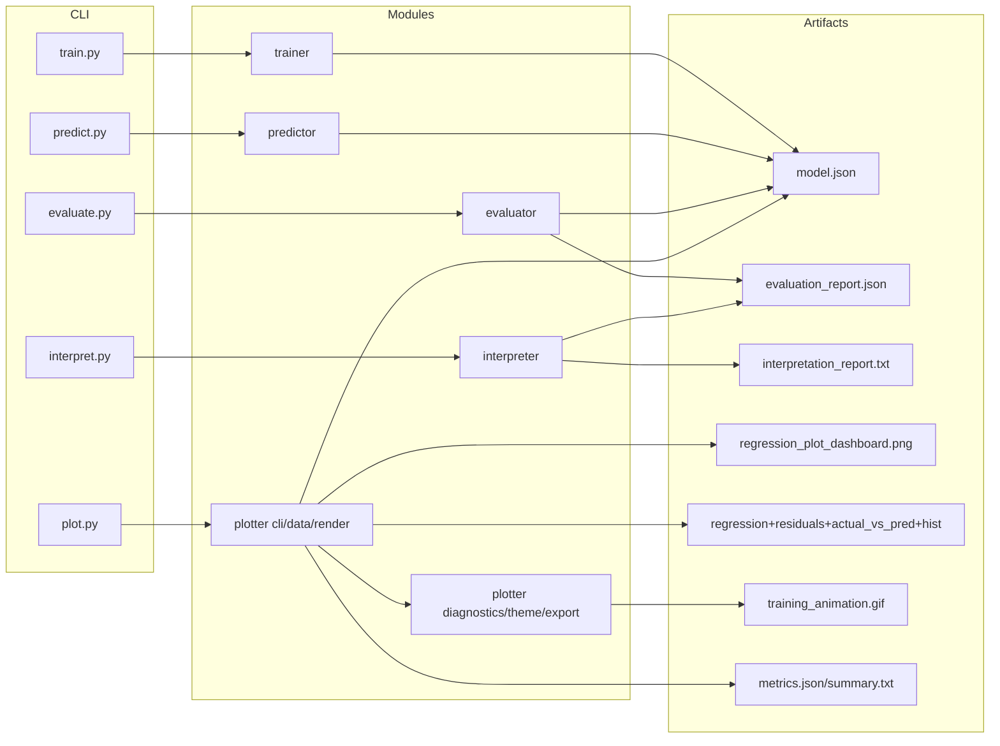

# Architecture

This document describes the internal design of `ft_linear_regression`.

## Layered architecture

## Data flow

1. `trainer` loads dataset, validates values, splits train/test, trains model, and writes payload.
2. `predictor` loads/validates model payload and predicts in safe bounded mode.
3. `evaluator` computes model and baseline metrics on full/train/test scopes.
4. `plotter` renders a 2x2 dashboard (regression, residuals, histogram, actual-vs-predicted), can export per-diagnostic images, and can generate an optional gradient descent animation GIF.
5. `interpreter` converts evaluation JSON into plain-language conclusions.

## Key design principles

- Explicit validation at boundaries (CSV, JSON, CLI input).
- Typed data flow through dataclasses.
- Small focused modules over monolithic scripts.
- Predictable fallback and strict policies.

## Boundaries and responsibilities

- `trainer`: training-only logic and model payload generation.
- `predictor`: runtime model loading and prediction path.
- `evaluator`: metric math and benchmark comparison.
- `plotter`: visual diagnostics and report extraction.
- `interpreter`: communication layer for non-technical readers.

## Reliability notes

- Normalization + epsilon checks in training.
- Finite checks for all numeric inputs.
- Prediction upper-bound guard against unstable model states.
- Non-zero exit codes for fatal CLI errors.
